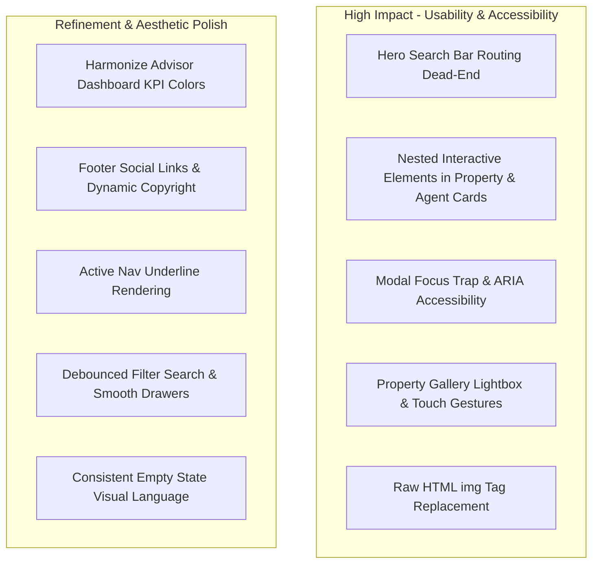

# HAVEN — Comprehensive Design & UX Audit Report

**Date:** October 2026  
**Target:** HAVEN Luxury Real Estate Platform  
**Scope:** Public Website, Client Dashboard, Advisor Command Center, Design System & Reusable Components  
**Guiding Philosophy:** Preserve HAVEN’s core identity — *premium, modern, editorial, visual, warm, trustworthy, and simple*. No disruptions to business logic, Supabase database schema, RLS policies, authentication handlers, or APIs.

---

## Table of Contents

1. [Executive Summary & Brand Identity Alignment](#1-executive-summary--brand-identity-alignment)
2. [Design Tokens, Typography & Global Styling Audit](#2-design-tokens-typography--global-styling-audit)
3. [Global Layout & Shell Audit](#3-global-layout--shell-audit)
   - 3.1 Header & Desktop Navigation
   - 3.2 Mobile Navigation Drawer
   - 3.3 Global Footer
   - 3.4 Shared Modals (Favorites & Profile)
4. [Public Website Audit](#4-public-website-audit)
   - 4.1 Homepage & Hero Section
   - 4.2 Hero Search Bar
   - 4.3 Interactive Architectural Showcase Gallery
   - 4.4 Lifestyle Cards & Editorial Grid
   - 4.5 Properties Catalog & Filter Bar
   - 4.6 Property Catalog Split View & Map
   - 4.7 Property Details Page (`/properties/[slug]`)
   - 4.8 Photo Gallery Component
   - 4.9 Agent Directory & Profile Pages
   - 4.10 Editorial Pages (About & Contact)
5. [Client Dashboard Audit (`/dashboard`)](#5-client-dashboard-audit-dashboard)
6. [Advisor Command Center Audit (`/agent`)](#6-advisor-command-center-audit-agent)
7. [Cross-Cutting Audits](#7-cross-cutting-audits)
   - 7.1 Image Presentation & Asset Optimization
   - 7.2 Typography Scale & Text Contrast
   - 7.3 Accessibility (WCAG 2.1 AA)
   - 7.4 Motion, Transitions & Micro-Interactions
   - 7.5 Responsive Layouts & Touch Ergonomics
8. [Categorized Issues: High Impact vs. Polish](#8-categorized-issues-high-impact-vs-polish)
9. [Prioritized Incremental Enhancement Roadmap](#9-prioritized-incremental-enhancement-roadmap)

---

## 1. Executive Summary & Brand Identity Alignment

HAVEN has established a strong aesthetic foundation. The pairing of **Playfair Display** (editorial serif) and **Plus Jakarta Sans** (clean, modern sans-serif), underpinned by an earthy warm palette (`#f7f6f2` linen background, `#1e2022` deep charcoal, `#c26d45` terracotta secondary, and `#5e6c5b` olive tertiary), conveys an upscale, architectural publication feel rather than a generic MLS portal.

However, a forensic inspection of the codebase reveals concrete gaps between this vision and the current implementation:
1. **Critical Usability Gaps:** The homepage Hero Search Bar renders without submission routing, leaving the primary hero call-to-action non-operational. Several card components swallow clicks or nest interactive elements inside links.
2. **Image Delivery & Rendering Inconsistencies:** Across multiple key components (`PropertyCard`, `LifestyleCard`, `AgentCard`), native unoptimized HTML `` elements are mixed with Next.js `<Image unoptimized />`, bypassing Next.js responsive image sizing, modern WebP/AVIF format negotiation, and blur placeholder capabilities.
3. **Accessibility (WCAG 2.1 AA) Deficits:** Modals lack focus traps and `aria-labelledby` linkages; several icon-only buttons lack accessible labels; form inputs lack proper screen-reader labels; and low-contrast muted labels (`#44474a` on `#1e2022` or faint variants) fail AA contrast requirements.
4. **Gallery & Media Experience:** Luxury architectural properties are heavily dependent on visual immersion, yet the property detail gallery lacks a full-screen lightbox, pinch/zoom, keyboard pagination, or swipe gesture controls.
5. **Visual Hierarchy & State Consistency:** Dashboard and Agent portal layouts use inconsistent card paddings, misaligned metric badge colors, and hardcoded dark-mode utility classes that conflict with the warm linen theme.

---

## 2. Design Tokens, Typography & Global Styling Audit

### 2.1 Token Architecture (`src/app/globals.css`)
- **Evidence:** [`src/app/globals.css`](file:///d:/Haven/haven/src/app/globals.css#L3-L63)
- **Current Setup:**
  ```css
  --color-primary: #1e2022;
  --color-secondary: #c26d45;
  --color-tertiary: #5e6c5b;
  --color-background: #f7f6f2;
  --color-surface: #ffffff;
  --color-divider: #e6e4dd;
  --color-foreground: #1e2022;
  --color-muted: #44474a;
  ```
- **Issues Identified:**
  1. **Missing Semantic Neutral Shades:** The tokens jump from `--color-surface` (`#ffffff`) and `--color-divider` (`#e6e4dd`) to `--color-muted` (`#44474a`) and `--color-primary` (`#1e2022`). There are no tokens for subtle surface elevations (`surface-subtle`, `surface-hover`, `surface-active`), leading developers to use ad-hoc Tailwind classes like `bg-[#eae8e1]/70`, `bg-[#f3f1eb]`, and `bg-black/5` across components.
  2. **Incomplete Tailwind Theme Mapping:** In `@theme inline`, shadow tokens (`--shadow-floating`, `--shadow-card`) defined in `:root` (lines 31-35) are not bound inside the `@theme` block, causing `shadow-card` and `shadow-floating` to rely on standard CSS variables rather than first-class Tailwind utility classes.
  3. **Absence of Focus Ring & Focus Visible Standards:** Focus outlines are defined inconsistently across inputs (`focus:ring-2 focus:ring-primary/10`), buttons (`focus:ring-2 focus:ring-primary/20`), and cards (no focus ring at all).

---

## 3. Global Layout & Shell Audit

### 3.1 Header (`src/components/layout/Header.tsx`)
- **Severity:** Medium
- **Evidence:** [`src/components/layout/Header.tsx`](file:///d:/Haven/haven/src/components/layout/Header.tsx#L50-L65), [`src/components/layout/Header.tsx`](file:///d:/Haven/haven/src/components/layout/Header.tsx#L71-L80)
- **Observations:**
  1. **Active Underline Visual Weight:** The active navigation style (`underline underline-offset-8 decoration-2 decoration-primary`) uses standard CSS text decoration. On high-DPI displays, text underlines can cross descending letterforms ('g', 'p', 'y') unevenly.
  2. **Saved Favorites Counter Absence:** The header displays the Heart icon button, but gives no visual count indicator (badge) of how many properties the user has bookmarked. The user has to click open the modal to discover if any properties are saved.
  3. **Touch Target Size on Mobile:** The menu toggle button has `p-2` with an icon of `h-6 w-6`, resulting in a ~40x40px target, slightly below the recommended 44x44px minimum touch target for accessibility guidelines (WCAG 2.5.5).
- **Recommendation:**
  - Add a pill counter badge to the Favorites Heart icon when `savedCount > 0`.
  - Replace text-underline with an absolute bottom border pill (`after:absolute after:bottom-0 after:h-0.5 after:bg-secondary`) or clean border accent that prevents font descender clipping.
  - Expand touch targets to a minimum of 44x44px (`min-h-[44px] min-w-[44px]`).

### 3.2 Mobile Navigation Drawer (`src/components/layout/MobileMenu.tsx`)
- **Severity:** Medium
- **Evidence:** [`src/components/layout/MobileMenu.tsx`](file:///d:/Haven/haven/src/components/layout/MobileMenu.tsx#L49-L55)
- **Observations:**
  1. **Scroll Lock & Escape Handling:** The mobile menu drawer does not trap keyboard focus inside the drawer when open. Users tabbing with a keyboard can tab behind the drawer into the inert background page.
  2. **Non-Standard Backdrop Blur Class:** Line 49 uses `backdrop-blur-xs`, which is non-standard in Tailwind v4 and falls back to unblurred opacity.
  3. **Dual Role Navigation Density:** If an authenticated agent opens the mobile menu, the vertical drawer displays 15+ links, creating excessive vertical scrolling without collapsible accordions.
- **Recommendation:**
  - Implement focus trapping and return focus to the hamburger trigger button upon closing.
  - Standardize backdrop blur to `backdrop-blur-sm`.
  - Group links into clean collapsible disclosure accordions ("Explore", "My Sanctuary", "Advisor Tools").

### 3.3 Global Footer (`src/components/layout/Footer.tsx`)
- **Severity:** High
- **Evidence:** [`src/components/layout/Footer.tsx`](file:///d:/Haven/haven/src/components/layout/Footer.tsx#L34-L50), [`src/components/layout/Footer.tsx`](file:///d:/Haven/haven/src/components/layout/Footer.tsx#L80-L146), [`src/components/layout/Footer.tsx`](file:///d:/Haven/haven/src/components/layout/Footer.tsx#L163-L168)
- **Observations:**
  1. **Dead & Colliding Routing:** Links for "Careers", "Journal", "Privacy Policy", "Terms of Service", "Cookie Preferences" all point to `/about`. Clicking "Cookie Preferences" navigates away to `/about` with no anchor or modal.
  2. **Inaccessible Social Media Elements:** Social icons (`Camera`, `BookOpen`, `AtSign`) are raw SVG icons without `<a>` wrapping, without `href`, without `aria-label`, and without keyboard focusability.
  3. **Hardcoded Copyright Date:** Line 160 hardcodes `© 2025` rather than utilizing dynamic year generation (`new Date().getFullYear()`).
  4. **Newsletter Form Usability:** The input has no `<label>` or `aria-label`, and the form has an empty `onSubmit={(e) => e.preventDefault()}` with no feedback state (success / error confirmation).
- **Recommendation:**
  - Wrap social icons in accessible `<a>` elements with `aria-label` and external rel attributes.
  - Add `aria-label="Email address for newsletter"` to the input and a brief interactive toast/confirmation state upon submission.
  - Replace hardcoded year with dynamic year.
  - Point legal and content links to appropriate dedicated paths or modals rather than redirecting all to `/about`.

### 3.4 Shared Modals (`src/components/ui/Modal.tsx`, `FavoritesModal.tsx`, `ProfileModal.tsx`)
- **Severity:** High (Accessibility & UX)
- **Evidence:** [`src/components/ui/Modal.tsx`](file:///d:/Haven/haven/src/components/ui/Modal.tsx#L25-L67)
- **Observations:**
  1. **Missing Keyboard Focus Trap:** Pressing `Tab` inside `Modal.tsx` traverses out of the modal container into the obscured background DOM.
  2. **Missing ARIA Linkage:** The modal sets `role="dialog"` and `aria-modal="true"`, but does not supply `aria-labelledby` referencing the title element ID, preventing screen readers from announcing modal context.
  3. **Z-Index Layering Inconsistencies:** `Modal.tsx` uses `z-50`, but certain map overlay controls and fixed drawer containers also share `z-50`, causing occasional stacking context collisions.
- **Recommendation:**
  - Introduce an accessible focus trap hook (`useFocusTrap`) that locks focus within the dialog and returns focus to the opener element upon closure.
  - Link `aria-labelledby="modal-title"` to `<h3 id="modal-title">`.

---

## 4. Public Website Audit

### 4.1 Homepage & Hero Section (`src/app/(public)/page.tsx`)
- **Severity:** Medium
- **Evidence:** [`src/app/(public)/page.tsx`](file:///d:/Haven/haven/src/app/%28public%29/page.tsx#L221-L263)
- **Observations:**
  1. **Background Texture Visual Grain:** The radial dot pattern (`[radial-gradient(#c26d45_1px,transparent_1px)] [background-size:32px_32px]`) has an opacity of `0.15` on `#f3f1eb`. On low-contrast displays or OLED panels, the terracotta dots can produce a slight visual moiré vibration behind the large display typography.
  2. **Hero Typographic Proportion:** The headline (`text-4xl sm:text-6xl lg:text-7xl font-semibold`) looks editorial on desktop, but on mobile devices (320px–375px), long words in the heading can hyphenate awkwardly or cause excessive line wrapping.
  3. **Stats Bar Hierarchy:** The stats strip divides into 4 columns. On mobile, it collapses to a 2x2 grid, but the divider border is placed globally at the top (`border-t`), leaving the bottom two stats floating without adequate separation from the subsequent section.

### 4.2 Hero Search Bar (`src/components/home/HeroSearchBar.tsx`)
- **Severity:** Critical (Core Usability Issue)
- **Evidence:** [`src/app/(public)/page.tsx`](file:///d:/Haven/haven/src/app/%28public%29/page.tsx#L241), [`src/components/home/HeroSearchBar.tsx`](file:///d:/Haven/haven/src/components/home/HeroSearchBar.tsx#L46-L56)
- **Observations:**
  1. **Disconnected Submit Event:** In `src/app/(public)/page.tsx`, `<HeroSearchBar />` is rendered with **no props**. Inside `HeroSearchBar.tsx`, `handleSubmit` only calls `onSearchSubmit?.()`. Because the callback is omitted, submitting the search form (clicking "Search" or pressing Enter) does absolutely nothing. The user is trapped on the homepage without navigating to `/properties` with query parameters.
  2. **Non-Synchronized Filter Values:** The dropdown options for property types use values (`"villas"`, `"penthouses"`, `"apartments"`, `"waterfront"`), whereas the properties catalog page expects singular enum values (`"villa"`, `"penthouse"`, `"apartment"`, `"chalet"`). Even if submitted, the parameter values would fail to filter the catalog.
- **Recommendation:**
  - Wire default navigation in `HeroSearchBar.tsx` using `useRouter()` to push `router.push('/properties?...')`.
  - Harmonize filter enum values between `HeroSearchBar` and `PropertyFiltersBar`.

### 4.3 Interactive Architectural Showcase Gallery (`src/components/home/InteractivePropertyGallery.tsx`)
- **Severity:** Medium
- **Evidence:** [`src/components/home/InteractivePropertyGallery.tsx`](file:///d:/Haven/haven/src/components/home/InteractivePropertyGallery.tsx#L96-L150)
- **Observations:**
  1. **Desktop Accordion Click Target Ambiguity:** In the desktop expandable layout, clicking an active card navigates to `/properties/[slug]`, whereas clicking an inactive card expands it. The visual affordance does not clearly communicate this distinction: users trying to expand a card sometimes accidentally double-click and trigger unexpected navigation.
  2. **Mobile Viewport Representation:** On mobile (<768px), the accordion collapses into a stacked carousel with left/right buttons. The mobile card height (`h-[440px]`) consumes almost the entire mobile viewport, pushing navigational chevrons below the fold on smaller devices.
  3. **High CPU Transitions:** Expanding and collapsing flex items via `transition-all duration-700 ease-[cubic-bezier(0.16,1,0.3,1)]` triggers layout reflows (`flex-grow`, `flex-basis`). On lower-powered mobile devices or older laptops, this produces frame drops.
- **Recommendation:**
  - Add explicit "Explore Residence →" button inside the active card rather than delegating navigation to the entire container surface.
  - Optimize mobile card height to `min(380px, 60vh)` to ensure carousel controls and next preview hints remain visible above the fold.
  - Animate container dimensions using GPU-accelerated transforms where feasible.

### 4.4 Lifestyle Cards & Editorial Grid (`src/components/home/LifestyleCard.tsx`)
- **Severity:** Medium
- **Evidence:** [`src/components/home/LifestyleCard.tsx`](file:///d:/Haven/haven/src/components/home/LifestyleCard.tsx#L33-L39)
- **Observations:**
  1. **Unoptimized Native Image:** Uses standard HTML `` instead of Next.js `<Image />`. This bypasses responsive device sizing and modern WebP generation.
  2. **Dark Vignette Gradient Legibility:** The gradient overlay (`from-black/80 via-black/30 to-transparent`) leaves text in the bottom corner readable, but when viewing lighter architectural photography (e.g. white Cycladic villas or bright sunlit interiors), the transition edge of `via-black/30` creates a sharp muddy band across the center of the image.
- **Recommendation:**
  - Replace `` with Next.js `<Image fill sizes="(max-width: 640px) 100vw, (max-width: 1024px) 50vw, 25vw" className="object-cover" />`.
  - Smooth the gradient with CSS linear-gradient easing (`linear-gradient(to top, rgba(0,0,0,0.85) 0%, rgba(0,0,0,0.4) 40%, rgba(0,0,0,0) 80%)`).

### 4.5 Properties Catalog & Filter Bar (`src/components/properties/PropertyFiltersBar.tsx`)
- **Severity:** Medium
- **Evidence:** [`src/components/properties/PropertyFiltersBar.tsx`](file:///d:/Haven/haven/src/components/properties/PropertyFiltersBar.tsx#L153-L250)
- **Observations:**
  1. **Visual Density on Medium Viewports:** The filter bar arranges 5 controls in a single 12-column grid (`md:grid-cols-12`). On viewports between 768px and 1024px (tablets and small laptops), select inputs become constrained and labels truncate.
  2. **Search Input Debounce Lack:** The keyword search input requires the user to hit Enter or click a button. When users type quickly, there is no automatic debounced search, which modern discovery platforms offer.
  3. **Filter Drawer Animation:** Clicking the "Filters" button reveals advanced filters (price ranges, area, city) with an instantaneous pop-in rather than a smooth accordion collapse/expand animation.
- **Recommendation:**
  - Re-adjust grid breakpoints: `grid-cols-1 sm:grid-cols-2 lg:grid-cols-12`.
  - Add subtle height transition or slide-over drawer for advanced filters on smaller screens.

### 4.6 Property Catalog Split View & Map (`src/components/properties/PropertyCatalogView.tsx`)
- **Severity:** Medium
- **Evidence:** [`src/components/properties/PropertyCatalogView.tsx`](file:///d:/Haven/haven/src/components/properties/PropertyCatalogView.tsx#L140-L240)
- **Observations:**
  1. **Map Loading State Disconnect:** The MapLibre map component loads dynamically with a pulsing skeleton. However, when switching between "Split" and "Map" views, the map completely remounts and re-fetches vector tiles, causing a noticeable visual flash.
  2. **Map Card Pin State Persistence:** Hovering over a property card in split view highlights the pin on the map, but hovering a pin on the map does not smoothly scroll the corresponding card into view in the side panel.
  3. **Mobile Split View Constraints:** In "Split" view on mobile screens, the map takes half the screen height while the card list takes the lower half, leaving room for only 0.75 cards visible at a time.
- **Recommendation:**
  - Preserve map instance in DOM across view changes rather than unmounting.
  - Automatically switch mobile view from "Split" to a toggleable "Cards / Map" segmented control on viewports under 768px.
  - Implement bidirectional synchronization: clicking a map pin smoothly scrolls the list to the active card.

### 4.7 Property Details Page (`src/app/(public)/properties/[slug]/page.tsx`)
- **Severity:** High
- **Evidence:** [`src/app/(public)/properties/[slug]/page.tsx`](file:///d:/Haven/haven/src/app/%28public%29/properties/%5Bslug%5D/page.tsx#L328-L380), [`src/app/(public)/properties/[slug]/page.tsx`](file:///d:/Haven/haven/src/app/%28public%29/properties/%5Bslug%5D/page.tsx#L433-L497)
- **Observations:**
  1. **Specs Bar Repetitive Grid:** The 6-metric architectural bar (`Bedrooms`, `Bathrooms`, `Total Area`, `Year Built`, `Parking`, `Status`) is presented as 6 equal vertical boxes with icons. On smaller screens, this collapses to a 2x3 grid that pushes the primary narrative down the page.
  2. **Sticky Contact Card Stacking Context:** The advisor inquiry card in the right column uses `sticky top-28`. On shorter laptop screens (e.g. 1366x768), the form exceeds the viewport height, making the submit button inaccessible without scrolling past the narrative.
  3. **Architectural Narrative Formatting:** Long property descriptions are rendered with `whitespace-pre-line` directly inside a single `<p>` tag without editorial typographical treatment (drop caps, sub-sections, or lead paragraph styling).
- **Recommendation:**
  - Give the narrative an editorial visual treatment (lead paragraph with larger type, subtle accent dividers).
  - Add `max-h-[calc(100vh-140px)] overflow-y-auto` to the sticky advisor card to ensure form actions remain reachable on short viewports.

### 4.8 Photo Gallery Component (`src/components/properties/PropertyGallery.tsx`)
- **Severity:** High (Core Editorial Value)
- **Evidence:** [`src/components/properties/PropertyGallery.tsx`](file:///d:/Haven/haven/src/components/properties/PropertyGallery.tsx#L112-L163)
- **Observations:**
  1. **No Lightbox or Fullscreen Inspection:** For a luxury real estate product, high-resolution architectural photography is the primary conversion asset. Currently, clicking the main hero image does nothing. There is no full-screen lightbox, modal zoom, or high-res preview mode.
  2. **Thumbnail Overflow Visibility:** The thumbnail strip uses native horizontal scrolling (`overflow-x-auto`). There are no visual gradient fades or scroll arrows on the edges to signal that more thumbnails exist off-screen.
  3. **No Swipe Support on Touch:** Mobile users cannot swipe horizontally across the main photo to view the next image; they are forced to tap small thumbnails below.
- **Recommendation:**
  - Implement an accessible full-screen Lightbox modal with next/prev arrow keys, ESC to close, and zoom capability.
  - Add touch swipe handlers (`onTouchStart`, `onTouchEnd`) on the main image container.
  - Add gradient edge masks on the thumbnail scroll container to indicate hidden items.

### 4.9 Agent Directory & Profile Pages (`src/app/(public)/agents/page.tsx`, `[slug]/page.tsx`)
- **Severity:** Medium
- **Evidence:** [`src/app/(public)/agents/[slug]/page.tsx`](file:///d:/Haven/haven/src/app/%28public%29/agents/%5Bslug%5D/page.tsx#L74-L86), [`src/components/agents/AgentCard.tsx`](file:///d:/Haven/haven/src/components/agents/AgentCard.tsx#L50-L53)
- **Observations:**
  1. **Invalid HTML Nesting:** In `src/app/(public)/agents/[slug]/page.tsx` lines 74 & 80:
     ```tsx
     <a href={`tel:${agent.phone}`}><Button>Call</Button></a>
     ```
     Nesting a `<button>` inside an `<a>` is invalid HTML and causes screen readers to announce conflicting interactive roles.
  2. **Swallowed Card Clicks in `AgentCard.tsx`:** The card uses an absolute stretched link on the agent's name (`<span className="absolute inset-0" />`), but places a "Contact Agent" `<Button>` at the bottom. If `onContactClick` is omitted (as on the homepage and directory page), clicking "Contact Agent" does nothing, and the button prevents the parent card link from firing.
- **Recommendation:**
  - Remove button nesting inside links; render styled `<a>` elements directly.
  - If `onContactClick` is not provided, make the button navigate to `/agents/${agent.slug}#contact` or the agent's detail page.

### 4.10 Editorial Pages: About & Contact (`src/app/(public)/about/page.tsx`, `contact/page.tsx`)
- **Severity:** Low (Polish)
- **Evidence:** [`src/app/(public)/about/page.tsx`](file:///d:/Haven/haven/src/app/%28public%29/about/page.tsx#L37-L44), [`src/app/(public)/contact/page.tsx`](file:///d:/Haven/haven/src/app/%28public%29/contact/page.tsx#L80-L125)
- **Observations:**
  1. **Unoptimized Unsplash Asset:** `AboutPage` loads an unoptimized external Unsplash image via standard `` tag without responsive sizing tokens.
  2. **Contact Form Field State Feedback:** The contact form displays a simple success card after submission, but lacks inline validation styling or loading spinner states during submission.

---

## 5. Client Dashboard Audit (`/dashboard`)

- **Severity:** Medium
- **Evidence:** [`src/app/(dashboard)/dashboard/page.tsx`](file:///d:/Haven/haven/src/app/%28dashboard%29/dashboard/page.tsx#L54-L120)
- **Observations:**
  1. **Header Layout & Spacing Clutter:** The executive welcome header combines an avatar, role badge, title, subtitle, and three action buttons into a single card. On screens between 768px and 1024px, the buttons wrap into an uneven cluster beneath the subtitle.
  2. **Empty State Inconsistencies:** The empty state for "Saved Properties" uses a dashed border with a heart icon, whereas "Collections" uses a solid surface card with an icon, and "Inquiries" uses an outlined table state. Empty states across the dashboard lack a unified design language.
  3. **Visual Hierarchy in Metric Cards:** The 4 bento metric cards (`Saved Residences`, `Collections`, `Active Inquiries`, `Preferences`) display numbers with `text-2xl sm:text-3xl font-bold`, but the subtext below is small and lacks clear trend or status context.
- **Recommendation:**
  - Unify all dashboard empty states into a shared `EmptyState` component with consistent spacing, iconography, and action button placement.
  - Clean up the header button group into a primary CTA + secondary dropdown/icon button on tablet screens.

---

## 6. Advisor Command Center Audit (`/agent`)

- **Severity:** Medium
- **Evidence:** [`src/app/(agent)/agent/page.tsx`](file:///d:/Haven/haven/src/app/%28agent%29/agent/page.tsx#L60-L140)
- **Observations:**
  1. **Metric Card Color Semantics:** In the KPI analytics grid:
     - Active Listings uses `text-emerald-600 dark:text-emerald-400 bg-emerald-500/10`
     - Drafts uses `text-amber-600 bg-amber-500/10`
     - Total Inquiries uses `text-blue-600 bg-blue-500/10`
     - Portfolio Value uses `text-purple-600 bg-purple-500/10`
     Introducing 4 vibrant saturated rainbow colors (emerald, amber, blue, purple) contrasts sharply with HAVEN's warm architectural palette (charcoal, terracotta, olive, linen). It feels like a generic SaaS dashboard rather than an exclusive private real estate atelier.
  2. **Table Horizontal Overflow on Mobile:** In the inventory manager and client inquiry tables, wide tabular data overflows without visible scroll affordances or sticky header styling.
  3. **License Badge Contrast:** Line 72 renders `License ID` with `text-xs text-muted font-medium`, which blends into the background gradient.
- **Recommendation:**
  - Align Advisor KPI colors with the HAVEN design system: use primary charcoal, warm secondary terracotta (`#c26d45`), muted olive (`#5e6c5b`), and soft bronze tones rather than high-saturation web greens and blues.
  - Implement responsive card-based layout on mobile for tabular listings.

---

## 7. Cross-Cutting Audits

### 7.1 Image Presentation & Asset Optimization
- **Finding:** A dual pattern currently exists:
  - Some components use `getOptimizedImageUrl(url, preset)` with `<Image unoptimized />`.
  - Other components use raw ``.
- **Impact:**
  - Raw `` elements lack automatic `srcset` generation, causing mobile devices on high-DPI screens to either load blurry images or download heavy desktop-dimension assets.
  - Next.js layout shift protection (`placeholder="blur"` or fixed aspect ratios) is bypassed.
- **Remedy:** Standardize on a single reusable `<HavenImage />` wrapper component that enforces aspect ratios, applies CDN transformation parameters, provides smooth skeleton loading transitions, and manages graceful fallback handling.

### 7.2 Typography Scale & Text Contrast
- **Finding:**
  - Contrast ratios for `--color-muted` (`#44474a`) on `--color-background` (`#f7f6f2`): **7.5:1** (passes WCAG AAA).
  - However, when `--color-muted` is combined with opacity modifiers like `text-muted/70` or `text-muted/60` (as in footer and card details), the contrast ratio drops to **3.2:1**, failing the WCAG AA minimum threshold of 4.5:1 for body text.
- **Remedy:** Replace arbitrary opacity reductions (`text-muted/60`, `text-muted/70`) with dedicated accessible semantic text color tokens:
  - `text-foreground`: `#1e2022`
  - `text-muted`: `#44474a`
  - `text-subtle`: `#5c6065` (ensures minimum 4.8:1 contrast on `#f7f6f2`)

### 7.3 Accessibility (WCAG 2.1 AA)
1. **Interactive Nesting:** In `PropertyCard.tsx`, an `<a>` tag wraps the image, while inside the same relative container exist `<FavoriteButton>` and `<SaveToCollectionButton>`. While `pointer-events-auto` allows clicks, keyboard focus order is disjointed.
2. **Missing Input Labels:** Newsletter and search inputs often rely solely on `placeholder` without `<label>` or `aria-label`. Screen readers need persistent accessible names.
3. **Modal Focus Management:** As detailed in Section 3.4, lack of focus trapping and `aria-labelledby` leaves assistive tech users disoriented when dialogs open.

### 7.4 Motion, Transitions & Micro-Interactions
1. **Inconsistent Easing Curves:** Some components use standard Tailwind `duration-300`, while others use custom cubic-bezier `cubic-bezier(0.16,1,0.3,1)` with 700ms durations. The 700ms duration feels sluggish during rapid browsing.
2. **`prefers-reduced-motion` Coverage:** Only `InteractivePropertyGallery` checks `prefers-reduced-motion`. All other animated components (accordions, hover scale transitions on cards) continue animating unconditionally.
3. **Hover Scale Artifacts:** Property card image scale (`group-hover:scale-105`) causes slight sub-pixel text blurring in adjacent flex containers in Chromium browsers. Adding `transform-gpu will-change-transform` resolves this.

### 7.5 Responsive Layouts & Touch Ergonomics
1. **Touch Target Dimensions:** Several secondary buttons and icon links measure 32x32px or 36x36px. Touch devices require at least 44x44px to prevent mis-taps.
2. **Filter Bar on Mobile:** The filter bar consumes over 300px of vertical space on phones, pushing all listings below the fold.

---

## 8. Categorized Issues: High Impact vs. Polish



### High-Impact Improvements (Urgent Fixes)
| ID | Area / Component | Severity | Description | Dependencies |
|---|---|---|---|---|
| **HI-01** | `HeroSearchBar.tsx` | **Critical** | Search submission does not navigate to `/properties` with query params. | Next.js `useRouter` |
| **HI-02** | `Modal.tsx` | **High** | Missing focus trapping and `aria-labelledby`, violating WCAG dialog criteria. | Focus management utility |
| **HI-03** | `PropertyGallery.tsx` | **High** | No fullscreen lightbox, swipe gestures, or image zoom for luxury architectural photos. | Lightbox state logic |
| **HI-04** | `PropertyCard.tsx` / `AgentCard.tsx` | **High** | Redundant tab stops and nested button/link conflicts on cards. | Card link restructuring |
| **HI-05** | Image System (`LifestyleCard`, `AgentCard`, `About`) | **High** | Raw `` elements bypass Next.js optimization and cause layout shifts. | `<HavenImage>` / `next/image` |

### Optional Polish (Refinements)
| ID | Area / Component | Severity | Description | Dependencies |
|---|---|---|---|---|
| **PL-01** | `AgentOverviewPage.tsx` | **Medium** | SaaS rainbow KPI colors (blue, green, purple) clash with luxury warm brand. | Color token update |
| **PL-02** | `Footer.tsx` | **Medium** | Inaccessible social icons, hardcoded 2025 copyright, and dead links to `/about`. | Footer component edit |
| **PL-03** | `Header.tsx` | **Low** | Active underline clips letter descenders; heart icon lacks saved counter badge. | CSS & state |
| **PL-04** | `PropertyFiltersBar.tsx` | **Medium** | Rapid filter changes lack debouncing and smooth collapse animation. | Transition polish |
| **PL-05** | Dashboard & Agent Portals | **Medium** | Disparate empty states across saved, collections, and inquiries. | `EmptyState` component |

---

## 9. Prioritized Incremental Enhancement Roadmap

This roadmap is designed for phased execution with **zero business logic, Supabase, or API changes**.

```mermaid
gantt
    title HAVEN Incremental UX Enhancement Roadmap
    dateFormat  X
    axisFormat  Phase %s
    section Phase 1: Core Usability
    Fix Hero Search submission & catalog routing       :active, 0, 1
    Eliminate nested link & button click bugs         :0, 1
    Unify image handling with HavenImage component    :0, 1
    section Phase 2: Visual Immersion
    Add full-screen Lightbox & touch swipe to Gallery :1, 2
    Editorial narrative typography & sticky card fix  :1, 2
    Harmonize Advisor Command Center palette          :1, 2
    section Phase 3: Accessibility & Shell
    Implement accessible Modal focus trap & ARIA      :2, 3
    Footer audit: accessible social links & dynamic year:2, 3
    Active navigation badge & descender fix           :2, 3
    section Phase 4: Filter & Motion Polish
    Debounced search & smooth filter drawer           :3, 4
    Universal EmptyState component                    :3, 4
    Refined easing curves & prefers-reduced-motion    :3, 4
```



### Phase 1: Core Usability & Card Ergonomics
- **Task 1.1:** Connect `HeroSearchBar.tsx` to Next.js `useRouter`, synchronizing property types and price ranges with `/properties` URL query parameters.
- **Task 1.2:** Resolve card click target bugs in `AgentCard.tsx` and `PropertyCard.tsx`. Ensure keyboard tabbing visits only one primary link per card.
- **Task 1.3:** Create a standard `<HavenImage />` wrapper to replace raw `` instances across `LifestyleCard.tsx`, `AgentCard.tsx`, and `AboutPage.tsx`.

### Phase 2: Visual Immersion & Editorial Elevation
- **Task 2.1:** Enhance `PropertyGallery.tsx` with a lightweight, accessible full-screen Lightbox viewer with keyboard arrow navigation and mobile touch swipe.
- **Task 2.2:** Refine Property Details typography: style the architectural narrative with editorial lead paragraphs and prevent the sticky advisor card from exceeding viewport bounds.
- **Task 2.3:** Re-theme the Advisor Command Center (`/agent`) KPI cards from saturated web primaries to HAVEN's signature charcoal, terracotta, and warm olive tones.

### Phase 3: Accessibility & Global Shell Polish
- **Task 3.1:** Implement focus trap and `aria-labelledby` attributes in `Modal.tsx`.
- **Task 3.2:** Update `Footer.tsx`: wrap social icons in accessible `<a>` tags with `aria-label`, inject dynamic year, and add submission confirmation state to the newsletter form.
- **Task 3.3:** Add a saved items counter pill to the Header heart icon.

### Phase 4: Filters, Responsiveness & Micro-Motion
- **Task 4.1:** Add debouncing to keyword search in `PropertyFiltersBar.tsx` and smooth transition animation to the advanced filters disclosure.
- **Task 4.2:** Create a unified `EmptyState` component for all zero-state screens in `/dashboard` and `/agent`.
- **Task 4.3:** Audit all hover transitions to respect `prefers-reduced-motion` and add GPU transform hints to prevent sub-pixel blurring.

---
*Report compiled following thorough inspection of HAVEN design tokens, routes, layouts, and public/workspace components.*
